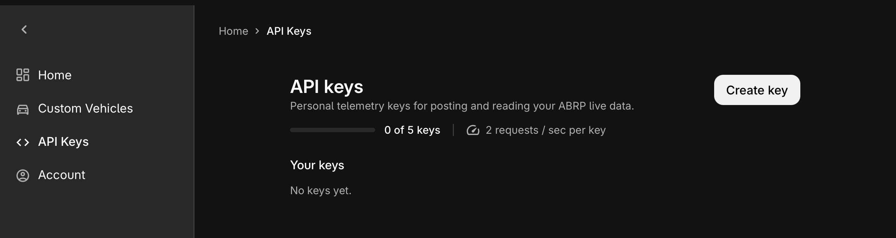
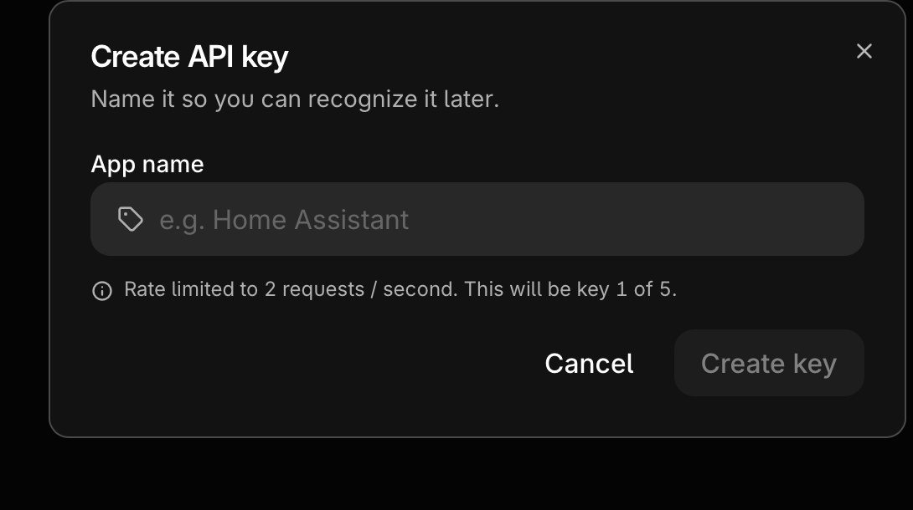
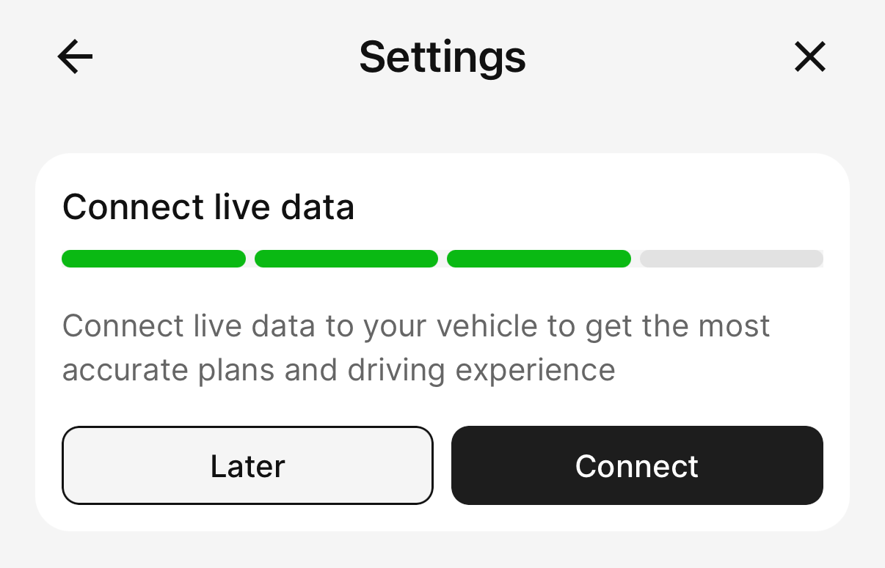
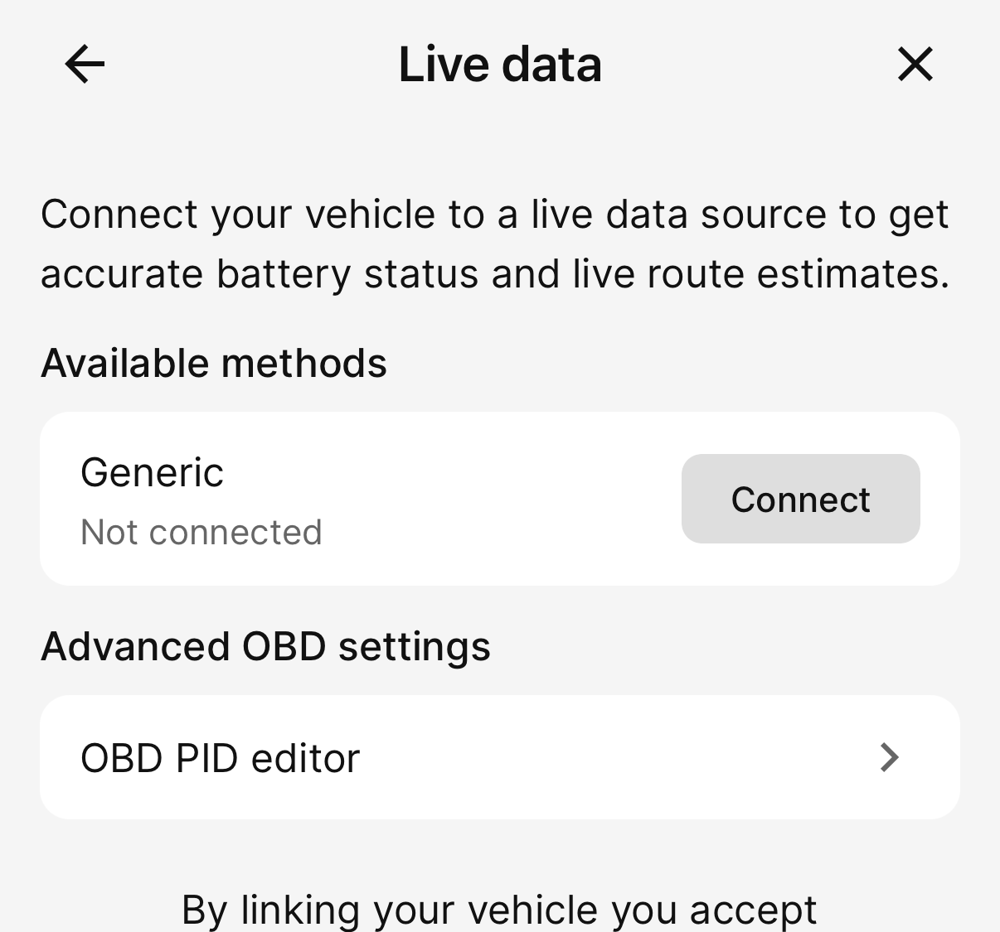
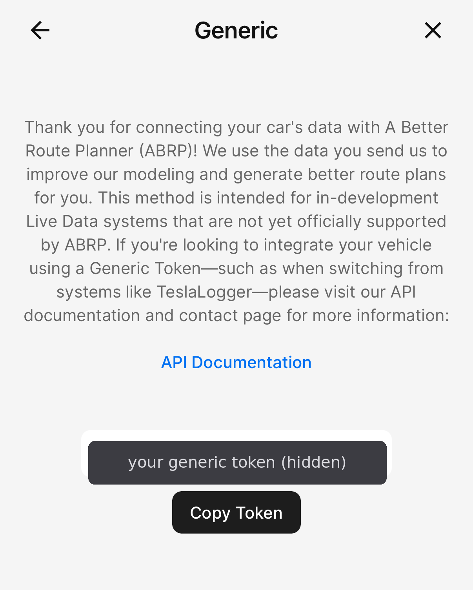

[](https://github.com/townsmcp/mg-saic-ha/blob/main/LICENSE)


[](https://github.com/townsmcp/mg-saic-ha/stargazers)

[](https://github.com/hacs/default)
[](https://github.com/townsmcp/mg-saic-ha/actions/workflows/validate.yaml)
[](https://github.com/townsmcp/mg-saic-ha/actions/workflows/hassfest.yaml)
[](https://analytics.home-assistant.io/)


</br></br>
# MG/SAIC CUSTOM INTEGRATION

<a href="https://buymeacoffee.com/Townsmcp" target="_blank"></a>
 
**Important Notes:** 
- **Using this integration causes the MG/SAIC mobile app to shut down if the same account is used, as per API requirements.**
- **To avoid issues, make sure to setup a Secondary Account on iSmart App.**

**Requirements:**
- Home Assistant 2025.2 or later.
- Confirmed compatible with Python 3.14, the runtime used by current Home Assistant core releases (2026.3+). No action needed on your part this is handled automatically by Home Assistant on supported installation methods.

## INSTALLATION
 
### HACS (Home Assistant Community Store)
 
1. Ensure that HACS is installed.
2. Go to HACS
3. Search for "MG SAIC" and download the repository.
4. Restart Home Assistant.
### Manual Installation
 
1. Download the latest release from the [MG SAIC Custom Integration GitHub repository](https://github.com/townsmcp/mg-saic-ha/releases).
2. Unzip the release and copy the `mg_saic` directory to `custom_components` in your Home Assistant configuration directory.
3. Restart Home Assistant.
## CONFIGURATION
 
To add the integration to your local Home Assistant, click here:
 
[](https://my.home-assistant.io/redirect/hacs_repository/?owner=townsmcp&repository=mg-saic-ha&category=integration)
 
Install the integration, restart Home Assistant and then add the integration, either:
 
[](https://my.home-assistant.io/redirect/config_flow_start?domain=mg_saic)
 
Or manually by:
 
1. Go to Configuration -> Integrations.
2. Click on the "+ Add Integration" button.
3. Search for "MG SAIC" and follow the instructions to set up the integration.
4. Select your type of account (email or phone), enter the details and select your region (EU, China, Australia, Brazil, Israel, Turkey, India, Thailand, Rest of World). If your country runs on separate SAIC infrastructure that is not covered by a built-in region, choose **Custom** and enter the API base URI, region code, and tenant ID for your market (known endpoints are collected in the [SAIC iSmart API community URI database](https://github.com/orgs/SAIC-iSmart-API/discussions/8)).
5. Once connected to the API, a list of available VINs associated with your account will be shown. Select the vehicle that you want to integrate and finish the process.
6. You will be asked which optional capabilities your vehicle has (heated seats, heated steering wheel, sunroof, window control, etc.). Tick the ones your car supports — this controls which entities are created. You can change these later via the integration's **Configure** (options) menu without re-adding the vehicle.
You may add additional vehicles by following the same steps as above.
 
### Multiple Vehicles
 
If you have more than one MG/SAIC vehicle, you can add each one as a separate integration entry. Vehicles on the **same SAIC account** are fully supported — the integration uses a single shared API session per account, so adding a second vehicle does not interfere with the first.
 
If your vehicles are on different SAIC accounts, add each account separately in the same way.
 
### Changing or updating your password
 
If you change your iSmart password (in the mobile app or on SAIC's website), the stored password stops working. You **no longer need to delete and re-add** the integration:
 
* **Automatic prompt:** the next time the integration finds the old password is rejected, Home Assistant raises a **"Reauthentication needed"** notification. Click it, enter your new password, and the vehicle reconnects — every other setting is kept.
* **Do it yourself at any time:** open the integration and choose **Reconfigure** from the entry's menu, then enter the new password.
 
**A note on password length.** The integration sends your password to SAIC exactly as entered (hashed, and never truncated on our side). However, SAIC's own servers limit password length when a password is *set*, so a very long password generated by a password manager can be accepted by the app but silently shortened on SAIC's side — after which it will never match what you type here. If a long password fails to log in, set a shorter one (around **16 characters or fewer**, with no trailing spaces) in the iSmart app and use that. The password field also trims accidental leading/trailing spaces from pasting.
 
 
## MG India Support (Beta)
 
MG India runs on a completely different backend to the rest of the world (a binary "TAP" protocol rather than the global REST API). As of v1.1.4-beta2 this integration supports MG India vehicles natively, powered by the [mg-ismart-india-client](https://pypi.org/project/mg-ismart-india-client/) library created and maintained by [John Lazarus](https://github.com/john-lazarus), who reverse-engineered the protocol.
 
### Setting up an India vehicle
 
Follow the normal configuration steps above and select **India** as your region. You will then be asked for your **4-digit iSmart PIN** — the same PIN you use to authorise commands in the iSmart India app. MG India requires this PIN for all remote commands. Only a secure one-way hash of the PIN is stored by the integration; the PIN itself is never saved. When choosing your vehicle you will see its model name with a shortened VIN (e.g. “MG Comet EV (…0001)”) rather than only the raw VIN.
 
### What works for India (confirmed on a real vehicle)
 
- Vehicle status: doors, windows, boot, bonnet, lock state, climate state, interior/exterior temperature, range, odometer, tyre pressures, 12V battery voltage
- State of Charge for BEVs, reported by the ordinary vehicle-status payload
- Door lock / unlock (with automatic verification — MG India sometimes applies a command without confirming it, and the integration re-checks the vehicle state)
- Climate control on / off
- Windows open / close
- Sunroof open / close (if equipped)
- Front heated seats (if equipped)
- Tailgate release
- Find My Car
 
### Not available for India
 
- **Charging data and control** — charging status/control, scheduled charging, battery heating, target SOC, charging current, and total battery capacity entities are not created for India vehicles. The BEV State of Charge above comes from vehicle status; MG India's platform still does not expose the separate charging endpoint (it is not present in the iSmart India app either).
- Window **ventilate** (crack open) — not yet confirmed safe on the India protocol; the open/close buttons work.
- Event-driven updates — India vehicles use regular polling only.
 
India support is in **beta** and actively looking for testers — see the [India tracking issue](https://github.com/townsmcp/mg-saic-ha/issues/221) and [Discussion #169](https://github.com/townsmcp/mg-saic-ha/discussions/169).
 
 
 
## SENSORS AVAILABLE
 
The MG/SAIC Custom Integration provides the following sensors, binary sensors, and controls. Not all entities are available on every vehicle — availability depends on vehicle type (BEV, PHEV, HEV, ICE) and optional equipment.
 
> **Looking for what "on"/"off" or a particular sensor value actually means?** See the [Entity States Reference](#entity-states-reference) section below — it lists every possible state for every status and control entity.
 
### SENSORS
 
#### General
- Brand
- Model
- Model Year
- VIN *(displayed masked, e.g. `LS**********46986`; the full VIN is available as the `vin_full` attribute for use in automations/services)*
- Mileage
- Interior Temperature
- Exterior Temperature
- Ancillary Battery Voltage *(12V battery)*
- Speed
- Power Mode
- Last Key Seen *(raw key fob identifier; shown as Unknown when key is not present)*
- Last Powered On
- Last Powered Off
- Last Vehicle Activity
- Last Update Time
- Next Update Time
#### Tyre Pressure
- Tyre Pressure Front Left
- Tyre Pressure Front Right
- Tyre Pressure Rear Left
- Tyre Pressure Rear Right
#### Electric / Hybrid
- State of Charge (SOC)
- Electric Range
- Instant Power *(kW draw/regen while driving; negative = traction, positive = regen/charge)*
- Fuel Level *(PHEV/HEV/ICE only)*
- Fuel Range *(PHEV/HEV/ICE only)*
#### Climate
- Front Left Heated Seat Level *(if equipped)*
- Front Right Heated Seat Level *(if equipped)*
- Steering Wheel Heat *(if equipped)*
  *(Note: the AC/HVAC running state itself is a **binary sensor**, not a sensor — see "HVAC Status" below.)*
#### Charging Data *(BEV/PHEV)*
- Charging Status *(Unplugged / Charging (AC) / Charging (DC) / V2X Discharging / …)*
- Charging Voltage
- Charging Current
- Charging Current Limit
- Charging Power
- Estimated Range After Charging
- Target SOC *(read-only mirror of the Target SOC slider — shown only on models where the iSmart app supports it)*
- Charging Duration
- Remaining Charging Time
- Added Electric Range
- Power Usage Since Last Charge
- Mileage Since Last Charge
- Efficiency Since Last Charge *(BEV/PHEV; km/kWh, derived from the two sensors above — see [Trip & efficiency statistics](#trip--efficiency-statistics))*
- Last Trip Distance *(distance driven on the last completed drive)*
- Last Trip Efficiency *(BEV/PHEV; switchable km/kWh · mi/kWh · kWh/100km, full breakdown in attributes)*
- Last Trip Fuel Economy *(ICE/HEV/PHEV; L/100km, with the full breakdown in its attributes)*
- Total Battery Capacity *(kWh; corrected for models where the API reports an inaccurate value)*
- Battery Heating Status *(if equipped)*
- Reachability *(is the car awake / likely asleep / unreachable — see [Deep sleep & holiday mode](#deep-sleep--holiday-mode))*
- Data Freshness *(diagnostic: whether the last poll returned `live`, `cached` or `failed` data — see [Data Freshness sensor](#data-freshness-sensor))*
### Trip & efficiency statistics

The integration derives per-trip and per-charge efficiency from data it already collects — the odometer, state of charge, and (for combustion models) fuel level — so no extra setup is needed.

**Efficiency Since Last Charge** *(BEV/PHEV)* comes straight from the car's own `Mileage Since Last Charge` and `Power Usage Since Last Charge` figures, so it's available immediately and needs no trip tracking.

**Last Trip** sensors are populated when a drive ends (the car powers off). Distance and electric energy come from the car's own cumulative counters (`Mileage Since Last Charge` / `Power Usage Since Last Charge`), diffed between one trip and the next — so they match the car's own measurements and don't depend on exactly when the trip was detected. (For non-charging models, distance falls back to the odometer.) A charge between trips is handled automatically (the counters reset). A trip is one power-on to power-off, so a journey with a stop in the middle counts as two trips.

If a drive is never seen live — the car wasn't polled while it was powered (a short trip that fell between polls, or a missed vehicle-start message) — the trip is reconstructed afterwards from the odometer movement once the car is next seen parked. These reconstructed trips carry `retrospective: true` and `timing: approximate` attributes, because the exact start/end times aren't known and several short hops in the same gap may be merged into one. If a trip ever gets stuck "open" (its power-off was missed), it's force-closed automatically so it doesn't block new trips.

The `Last Trip Efficiency` (BEV/PHEV) and `Last Trip Fuel Economy` (ICE/HEV/PHEV) sensors carry the full breakdown of the last drive in their **attributes**: distance, SOC used, energy in kWh, fuel used, duration, and both metric and mi/kWh figures. A `mg_saic_trip_completed` event also fires for each completed trip (with the same fields), so automations and the logbook can keep a full history without any single sensor holding a list.

Notes and limitations:
- **Units are switchable per entity.** The efficiency sensors use Home Assistant's `energy_distance` device class (HA 2025.2+), so you can switch each one between **km/kWh, mi/kWh and kWh/100km** in its settings — the same way Mileage switches between km and miles. On older HA they stay in km/kWh. Fuel economy is reported in **L/100km**; since HA has no fuel-consumption unit conversion, **UK and US mpg are provided in that sensor's attributes**.
- SOC and fuel level are whole-number percentages, so figures for very short trips are coarse.
- Trip *duration* is measured to the poll that detects shutdown, so treat it as approximate.
- Fuel figures in litres / L per 100 km need a per-model tank size; until one is set for a given model, the fuel sensor reports **fuel % used** but not litres, L/100km or mpg.
- If the car is charged or refuelled while parked mid-trip, that trip's electric/fuel figure is omitted and flagged (`charged_during_park` / `refuelled_during_park`) rather than reported wrongly.
- When a value can't be computed yet, the efficiency sensors read **Unknown** rather than Unavailable — e.g. `Efficiency Since Last Charge` while charging or right after a charge (0 km driven since), or `Last Trip Efficiency` for a trip where a charge spanned the drive. The sensor's attributes still show the breakdown so you can see why.

### BINARY SENSORS
 
#### Doors
- Door Front Left / Door Front Right *(named "Driver"/"Passenger" logically, but labelled by physical side — automatically swapped for RHD vs LHD vehicles)*
- Door Rear Left / Door Rear Right *(not present on 2-door models, e.g. MG Cyberster)*
- Bonnet Status
- Boot Status
#### Windows
- Window Front Left / Window Front Right
- Window Rear Left / Window Rear Right *(not present on convertibles with no rear glass, e.g. MG Cyberster)*
- Sunroof Status *(if equipped)*
- Ventilation *(reflects ventilation started from Home Assistant — see [Window Control](#window-control))*
#### Lights
- Dipped Beam Status
- Main Beam Status
- Side Light Status
#### Other
- Engine Status
- HVAC Status *(the AC/climate running state — see states table for what "on" actually covers)*
- Lock Status *(⚠️ reports on/off, not Locked/Unlocked — see Entity States Reference)*
- Wheel Tyre Monitor Status *(a "problem" sensor — on means a TPMS/tyre fault is reported, not that everything is fine)*
- Charging Gun State *(BEV/PHEV only)*
### EVENTS
 
- **Command Errors** — a single event entity with two possible event types:
  - `command_error` — fired when a remote command (lock, AC, charge, etc.) fails or is rejected by the vehicle.
  - `command_limit_reached` — fired specifically when the vehicle's remote-command allowance has been used up.
  Use this in automations to get notified when a command does not go through. Alongside the original `source` and `error` attributes (still present), each event now also carries readable ones: `action` (what was attempted, e.g. "Setting HVAC mode"), `reason` (a plain-English explanation, e.g. "The car couldn't be reached…"), and `code` (the SAIC return code where applicable, e.g. `4` or `8`).
### DEVICE TRACKER
- Latitude
- Longitude
- Elevation (Altitude)
- HDOP
- Satellites
- Heading *(numeric, `raw_heading` attribute)*
- Heading *(cardinal direction, e.g. N/NE/E/SE/S/SW/W/NW, `heading` attribute)*
### SWITCHES
- Charging Start/Stop
- Battery Heating *(if equipped)*
- Battery Heating Schedule *(if equipped — enables/disables the daily timed battery heating; set the time with the Battery Heating Schedule Time entity)*
- Front Defrost
- Rear Window Defrost
- Heated Seats *(if equipped)* — four independent switches: Front Left, Front Right, Rear Left, Rear Right. Front seat switches apply the level chosen in that seat's Level select (defaulting to Low if the select is Off); rear seats are on/off. See [Heated Seats](#heated-seats).
- Heated Steering Wheel *(if equipped — enable "Has Steering Wheel Heat" in options)*
- Sunroof *(if equipped — currently non-functional on tested models; see note below)*
- Charging Port Lock *(⚠️ "on" means locked — see Entity States Reference)*
- Holiday Mode *(slows polling to reduce wake-ups / 12V drain while the car is left for long periods — see [Deep sleep & holiday mode](#deep-sleep--holiday-mode))*
> **Sunroof note:** the sunroof switch and status are retained but are currently non-functional on tested models (e.g. MGS6 EV), where the SAIC API always reports the sunroof as closed regardless of its real position and no working control command has been identified. The option is off by default. It may be revisited if MG adds sunroof support to the iSmart app.
### BUTTONS
- Trigger Alarm
- Update Vehicle Data
- Open Boot *(momentary — releases the boot/tailgate latch; the SAIC API only supports remote opening, not closing, hence a button rather than a lock/cover)*
- Ventilate Windows / Open Windows / Close Windows *(if "Has Window Control" is enabled in options)* — act on all four door windows together. "Ventilate" cracks them open a few centimetres (mirroring the iSmart app's Ventilation feature); "Open" fully opens; "Close" closes. See [Window Control](#window-control).
### LOCK
- Lock entity for door lock/unlock
  *(There is no separate lock entity for the boot/tailgate — use the "Open Boot" button instead, since the API only supports releasing the latch remotely, not locking it again.)*
### CLIMATE
- AC Control Climate entity
  * Temperature
  * Fan Speed *(most models)* **or** HVAC mode + Preset *(mode-select models, e.g. MG S9 PHEV — see [Climate Control](#climate-control))*
  * HVAC mode (Cool / Fan Only / Off, plus Heat on models with a heater — the MG4 Electric, and mode-select models that support it)
### SLIDERS
- Target SOC *(shown only on models where the iSmart app supports it)*
### SELECT
- Charging Current Limit
- Heated Seat Front Left Level / Heated Seat Front Right Level *(if equipped)*
- Scheduled Charging Mode *(BEV/PHEV — Disabled / Until Target SOC / Until Scheduled Time. Selecting a mode sends one command applying the mode together with the Scheduled Charging Start/End times)*
### TIME
- Scheduled Charging Start / Scheduled Charging End *(BEV/PHEV — the charging window, shown as in the iSmart app. Changing these does **not** send a command; the window is applied when you change the Scheduled Charging Mode select, so adjusting both times costs a single command)*
- Battery Heating Schedule Time *(if equipped — the daily start time for scheduled battery heating, shown in your Home Assistant timezone. Changing it while the schedule is enabled pushes the new time to the vehicle immediately; otherwise it is held locally until the Battery Heating Schedule switch is turned on)*
**Note: Actions (Services) can be accessed and activated from the Actions menu under Developer Tools.**

 
 
## Climate Control
 
The MG SAIC integration exposes a climate entity for remote control of the vehicle's air conditioning. Because SAIC limits remote commands to **3 per cycle between starting the car with a key**, the integration is designed to use commands as efficiently as possible.
 
### Two control schemes
 
Not all MG models expose climate control the same way, so the integration uses one of the following schemes depending on your vehicle:
 
- **Fan-speed models (most cars):** a Low / Medium / High fan slider plus `Cool` / `Fan Only` / `Off` HVAC modes (and `Heat` on models with a confirmed heater, e.g. the MG4 Electric). This is the default and covers the standard MG4, Cyberster, and any model not specifically profiled.
- **Mode-select models (e.g. MGS5 EV, MGS6 EV, MG S9 PHEV, MG4 EV URBAN):** on some cars the SAIC API's "fan speed" value is not a fan speed at all — it is a fixed climate *mode* selector, and the car chooses its own fan speed. On these models a Low/Med/High slider is misleading, so instead the integration exposes HVAC modes and presets that map to the car's actual modes (see below). The correct scheme is selected automatically based on your vehicle. Available modes and presets vary by model — a car is only offered `Heat` or a `Defrost` preset if it actually supports them (the MG4 EV URBAN, for example, has no heat mode).
- **No-remote-fan models (e.g. MG HS PHEV / Super Hybrid):** this car has no remote fan control — the app's AC page has no fan slider and always runs the fan on AUTO — so the integration hides the fan slider and offers `Cool` / `Fan Only` / `Off` (temperature range 16–30 °C). Here `Fan Only` triggers the car's separate **AC Airflow** cabin-ventilation mode (fresh-air blower, no cooling), matching the app's dedicated AC Airflow button. Like the app, this requires the **AC to be off first**: if you select `Fan Only` while the AC is running, the integration doesn't send the command (which the car would reject anyway) — it leaves the AC on and raises a notification telling you to turn the AC off first, so none of your limited remote commands are wasted.
- **Simple-AC models (e.g. MG3 Hybrid):** a few cars only act on the basic AC command and ignore everything else, so they get a stripped-back `Cool` / `Heat` / `Off` climate entity (Cool = coldest, Heat = warmest) with no fan slider (see below).
 
### How commands are used
 
The SAIC API counts each instruction sent to the car as one command. To avoid wasting your allowance, only explicit HVAC mode or preset changes send a command. Adjusting fan speed or temperature on their own does not.
 
**Uses a command:**
- Turning the AC on (HVAC mode set to `Cool`, `Fan Only`, or `Heat`)
- Turning the AC off (HVAC mode set to `Off`)
- Switching between HVAC modes
- Selecting a preset (`Max Cool` / `Defrost`) on mode-select models
**Does NOT use a command:**
- Changing fan speed (`Low`, `Medium`, `High`) on fan-speed models
- Changing target temperature
### Recommended usage
 
Set your preferred temperature (and fan speed, on fan-speed models) **first**, then turn the AC on. The command sent to the car will include whatever settings you have already applied in HA. A complete remote pre-conditioning session uses exactly **2 commands** — one to turn on, one to turn off — leaving one spare for a lock or unlock action.
 
If you want to change settings while the AC is already running, update the values in HA first, then turn the AC off and back on. This applies your new settings using 2 commands.
 
### Voice and automation control

Home Assistant's voice assistants, the MCP bridge, and some automations can only set a limited range of entity types — in particular, they **cannot set a climate entity's mode**, so they can't turn the AC on from the climate widget alone. To make remote AC fully controllable that way, the integration also exposes the same climate state as plain, assistant-friendly entities that stay in sync with the climate entity (change one, the others follow):

- **Air Conditioning** *(switch)* — turns the AC on/off. This is the one an assistant can toggle by voice. Turning it **on runs the AC at whatever temperature is currently set** — it does not force a hot/cold extreme.
- **Climate Target Temperature** *(number)* — the setpoint as a plain number. Display-only, exactly like the climate slider: changing it never sends a command; it rides along with the next AC command.
- **Climate Mode** *(select)* — `Off` / `Cool` / `Fan Only` (and `Heat` where supported). Not shown on simple-AC models that only have `Cool`.
- **Climate Mode** *(sensor)* — a detailed read-back of the mode the car is actually running (`off` / `cool` / `fan_only` / `heat` / `defrost`), so an assistant or automation can confirm the result — more than the simple on/off HVAC Status. It also reports **On (under car control)** when the car's climate is running under **local** control (i.e. you're driving with it on from the dashboard) rather than from a remote command — see below.

All of these mirror the climate entity, so you can mix and match: set the temperature with the number, turn it on with the switch, and read the result from the sensor. The 3-command limit still applies — only turning the AC on/off or changing mode sends a command.

> **Setting a specific temperature:** the AC on/off switch (and the climate power button) run the AC at the **currently set temperature**. The `Cool` and `Heat` *modes* carry their own temperature — on simple-AC models like the MG3, `Cool` goes to the coldest setting and `Heat` to the warmest. So if you want a temperature **between** the extremes, **set the temperature first, then turn the AC on with the switch** — that pushes your chosen value. Using the `Cool`/`Heat` mode instead will move to the min/max end.

> **Climate under local control (while driving):** if you're driving with the climate on from the car's own dashboard, the car reports it as running under *local* control. The remote controls — the climate entity, the A/C switch and the Climate Mode select — represent what Home Assistant is *commanding*, so they stay **Off** in this case (there's no active remote command). Only the **Climate Mode sensor** reflects the physical reality, showing **On (under car control)**. This is also why the car's own dashboard temperature isn't shown while driving: SAIC doesn't report the car's live setpoint, so Home Assistant only ever shows the temperature *you've* set.

### Front defrost behaviour
 
Front defrost (the standalone **Front Defrost switch**, and the **Defrost preset** on mode-select models) mirrors the iSmart app exactly, based on decrypted app traffic and a live control test:
 
- **Always runs at 22°C**, regardless of the temperature set on the climate slider — this matches what the app sends. Your own temperature setting is **not** changed by starting defrost, and defrost auto-cancels after roughly 10 minutes, so your preference is intact for the next AC session.
- **Cannot start while the AC is already running.** The vehicle rejects this (the iSmart app blocks it too, asking you to turn AC Auto off first). Rather than waste one of your limited daily remote commands on a request the car would ignore, the integration does not send it — you get a **persistent notification** explaining the AC must be turned off first, plus a command-error event in the Logbook.
 
### Fan-speed models
 
**Fan speeds**
 
| HA setting | Behaviour |
|---|---|
| Low | Gentle airflow |
| Medium | Default when turning on |
| High | Maximum normal fan speed |
 
> **Note:** Fan speed values used internally vary by vehicle model. The integration automatically selects the correct values for your car based on its series. The Front Defrost command uses a separate API speed value and is never accidentally triggered by fan speed changes.
 
**HVAC modes**
 
| Mode | Behaviour |
|---|---|
| `Cool` | Runs the compressor with your chosen temperature and fan speed |
| `Heat` | Runs the resistive (PTC) heater — **shown only on models with a heater, e.g. the MG4 Electric.** Heats to the top of the temperature range (this is how the car's own app drives it) |
| `Fan Only` | Runs the fan without the compressor (blowing only) |
| `Off` | Stops all climate activity |

> **Note:** `Heat` appears only on models where resistive heating has been confirmed. On the MG4 Electric it engages the PTC heater; because of how the car works, heating always runs at the top of the temperature range rather than a chosen setpoint.
 
### Simple-AC models (MG3 Hybrid)

Some cars only accept the simplest remote-AC command and silently ignore the fuller one that carries a fan speed. The **MG3 Hybrid** is the first such model: it has a single command that just drives the cabin to a target temperature, heating or cooling as needed — there's no separate fan speed or mode. The integration therefore shows a stripped-back climate entity with two one-tap ends of the range:

| Mode | Behaviour |
|---|---|
| `Cool` | Air conditioning at the **coldest** setting (drops the setpoint to the minimum) |
| `Heat` | Air conditioning at the **warmest** setting (raises the setpoint to the maximum) |
| `Off` | Turns the air conditioning off |

Both `Cool` and `Heat` use the same underlying command — the only difference is the temperature they aim for — and each moves the temperature slider to the matching end automatically. There is **no fan-speed slider, no `Fan Only` mode, and no Front Defrost** on this model, because the car doesn't act on the commands those need. The MG3 also only reports its **driver window**, so only that one window sensor is created.

### Mode-select models (e.g. MG S9 PHEV, MG4 EV URBAN)
 
On these models there is **no fan-speed slider** — the car manages its own fan. Control is via HVAC modes and presets instead:
 
| Mode / Preset | Behaviour |
|---|---|
| HVAC `Cool` | AC on, automatic fan, follows your target temperature |
| HVAC `Heat` | Heating |
| HVAC `Fan Only` | Fan without the compressor |
| HVAC `Off` | Stops all climate activity |
| Preset `Max Cool` | Fast cool-down using the strongest cooling the car has; on models like the MG4 EV URBAN it also drops the temperature to the lowest setting in a single tap |
| Preset `Defrost` | Windscreen / upper-vent defrost |
 
> **Note:** not every mode-select car offers all of these. `Heat` and the `Defrost` preset are only shown on models that actually support them. The **MG4 EV URBAN**, for example, has no heat mode, so it shows only `Cool` / `Fan Only` / `Off` plus the `Max Cool` and `Defrost` presets — the Defrost preset gives URBAN owners a front-defrost control the iSmart app itself doesn't provide.
 
> **⚠️ Note for MG S9 PHEV owners:** from **1.1.2** this model uses the mode-select scheme. The previous Low/Med/High fan control has been replaced by the HVAC modes and presets above. If you have automations or scripts that called `climate.set_fan_mode` on your S9 PHEV, update them to use `climate.set_hvac_mode` (`cool` / `heat` / `fan_only`) or `climate.set_preset_mode` (`Max Cool` / `Defrost`) instead.
 
 
## Window Control
 
If your vehicle supports it, enable **Has Window Control** in the integration options to add three window buttons:
 
| Button | Action |
|---|---|
| Ventilate Windows | Cracks all four door windows open a few centimetres (mirrors the iSmart app's "Ventilation") |
| Open Windows | Fully opens all four door windows |
| Close Windows | Closes all four door windows |
 
Notes:
- The commands act on **all four door windows together** — the SAIC API does not support controlling a single window remotely.
- The window status sensors are open/closed only; the car does not report "ventilated" as distinct from "fully open", so a ventilated window shows as open.
- These commands are confirmed on the MGS6 EV. On other models the command is assumed to be the same — if it behaves differently on your car, please open an issue so we can add a per-model mapping.
### Ventilation binary sensor
 
A **Ventilation** binary sensor indicates whether the car is currently ventilating. The vehicle exposes no reliable ventilation status field (the remote-climate status reports the A/C, not ventilation, and window status can't distinguish "ventilated" from "fully open"), so this sensor uses **optimistic tracking of commands sent from Home Assistant**:
 
- It turns **on** when you press **Ventilate Windows**.
- It turns **off** when you press **Open Windows** or **Close Windows**, or once the windows report closed again (ventilation ended). A short guard keeps it on during the brief delay between pressing ventilate and the car actioning it.
> **Known limitation:** if you start ventilation from the **iSmart app** rather than Home Assistant, this sensor cannot detect it and will stay off (your window sensors will still correctly show the windows open). When ventilation is controlled through Home Assistant, the sensor is accurate.
## Heated Seats
 
When **Has Heated Seats** is enabled, the integration exposes:
 
- **Front Left / Front Right:** a Level select (Off / Low / Medium / High) **plus** an on/off switch.
- **Rear Left / Rear Right:** an on/off switch only.
**How front seats work:** the Level select only stores your chosen level — it does **not** send a command by itself. The level is applied when you turn that seat's switch on. If the switch is turned on while the select still says "Off", it defaults to **Low**. This mirrors the climate entity's "set the value, then activate" pattern and avoids spending a remote command every time you nudge the dropdown.
 
Each seat is sent as its own independent command, so changing one seat never disturbs another.
 
> **Note:** rear-seat heat status may not reliably report back from the car — on tested models the SAIC API does not always reflect the rear seats as "on" after a command, even though the command is sent. The switch still works; only the status read-back is affected.
 
 
## Event-Driven Updates
 
The integration polls the SAIC alarm message queue once per minute per account and automatically triggers an immediate data refresh when it detects:
 
- **Engine start** — data refreshes as soon as the car is driven away
- **Vehicle shutdown** — data refreshes after the car is turned off
- **Charging plug-in** — data refreshes when charging begins
This means you can set a long polling interval (e.g. 30 minutes or more) for idle/parked state and still get near-real-time updates when the car is active.
 
> **Multiple vehicles on one account:** The integration uses a single API session and a single message poll loop per SAIC account, regardless of how many vehicles are registered under it. This prevents session conflicts and duplicate API calls.
 
 
## A Better Route Planner (ABRP)

The integration can push each vehicle's live telemetry — state of charge, estimated range, charging state, outside temperature, odometer and (when the car reports a GPS fix) position — to [A Better Route Planner](https://abetterrouteplanner.com/). This lets ABRP plan and adjust routes using your car's real SoC **without an OBD dongle**, the same way the SAIC MQTT gateway does.

### What to expect

Telemetry is sent only when the car returns genuinely fresh data on a poll, so ABRP is fed real readings rather than cached ones. Because the data comes from SAIC's telematics (not a direct OBD link), updates arrive at your polling cadence — great for SoC, range and parked location, but not second-by-second position while driving. This is the same limitation any SAIC-based ABRP feed has.

### Setup

ABRP is configured per vehicle, in that vehicle's integration options — **Settings → Devices & Services → MG SAIC → (your car) → Configure (cog)**. You need **two** credentials, and you obtain **both** yourself:

1. **Create your ABRP API (telemetry) key.** Go to the [ABRP telemetry API keys page](https://abetterrouteplanner.com/home/app/api-keys/telemetry) and sign in with your ABRP account. (This page is linked from the **Telemetry API** section of <https://www.iternio.com/api>.) The integration does **not** ship a shared key, so this step is required.

   

   Click **Create key**, give it a name so you can recognise it later — for example `MG SAIC HA` — then click **Create key**.

   

   Copy the key it generates and keep it somewhere safe; you'll paste it into the integration. (You can create up to five keys.)

2. **Get your ABRP user token.** This is a **separate** credential from the API key above — a per-vehicle token ABRP uses to accept your data. Get it from the ABRP app (make sure the vehicle you want is selected):

   - Tap the **☰ menu** at the top right of the ABRP home screen to open **Settings**.
   - Under **Connect live data**, tap **Connect**.

     

   - Under **Available methods → Generic**, tap **Connect**.

     

   - Tap **Copy Token** and keep the token safe — this is your **ABRP user token**.

     

   (Per [ABRP's docs](https://www.iternio.com/api), user tokens can also be obtained via their OAuth flow, but this integration uses this manually-pasted token.)

3. Paste your key into **ABRP API key**, your token into **ABRP user token**, and save. **Both are required** — telemetry starts flowing on the next successful refresh once the pair is validated.

To **disable** ABRP for a vehicle, clear the fields and save.

Both credentials are validated against ABRP when you save them, so an incorrect key or token is flagged immediately rather than failing silently later.

### Multiple cars / adding a car later

Each vehicle is a separate config entry, so the ABRP token is stored per VIN — set a different token for each car in its own options. If you add another vehicle later (**Add** a new MG SAIC entry), just open that new car's options and paste its token. You can change or remove a token at any time via the same Configure screen.

 
## Deep sleep & holiday mode
 
### Deep sleep (why the car sometimes goes quiet)
 
After a car has been idle for a long time (often around a day), its telematics module goes into a deep sleep to save the 12V battery. While asleep it can still answer *cached* status requests, but it cannot service live commands — these fail with the SAIC "can't reach the car" error (return code 4). This is normal vehicle behaviour, not an integration fault.
 
On **PHEVs** this matters more than on BEVs: a PHEV only recharges its 12V battery while the car is running (driving or, in some cases, charging the main battery), whereas a BEV tops the 12V up from the main traction battery as needed. So a PHEV left parked for a long time is more likely to drift into deep sleep, and — as owners have observed — once it's asleep, often only actually **driving** the car reliably wakes it again.
 
### Reachability sensor
 
The **Reachability** sensor surfaces this at a glance, so you can tell when data may be stale rather than wondering why things have gone quiet. It has three states:
 
- **awake** — the car is powered on, or has reported activity recently
- **likely_asleep** — the car has reported no activity for longer than the *data staleness threshold* (default 12 hours, configurable); its data may be out of date
- **unreachable** — a live command recently failed with return code 4 (the car itself confirming it can't be reached)
The state is inferred from the **car's own reported activity**, not from how often the integration polls — so using holiday mode (below) does not make it read asleep incorrectly.
 
**Attributes** provide supporting evidence (none of which drives the state): `reported_battery_voltage` (see note), `hours_since_activity`, `last_command_unreachable`, `data_age_hours`, and `holiday_mode`.
 
> **Battery voltage note:** the reported aux-battery voltage is shown only as an attribute, never used to decide the state. The vehicle can mis-report its own aux voltage (one owner saw 11.7V reported in HA while a calibrated external monitor read 12.13V at the same moment), so it is surfaced as a rough early-warning hint, clearly labelled as possibly inaccurate.
 
### Data Freshness sensor
 
The **Data Freshness** sensor is a diagnostic entity that answers a different question from Reachability. Reachability describes the **car's** state (awake / asleep / unreachable); Data Freshness describes the **data's** state — how current the information from the most recent poll actually is. The two are separate on purpose: the car can be reachable while the poll still returns cached data. It has three states:
 
- **live** — the last poll returned a status whose timestamp advanced, i.e. genuinely fresh data straight from the car
- **cached** — the poll succeeded, but SAIC served the same, unchanged status (typical when the car is asleep and not reporting new data)
- **failed** — the last poll errored (for example a transient `return code 4`)
 
Like Reachability, it stays **always available** — including when polls are failing, since that's exactly when its `failed` state is most useful. It carries a single `last_update` attribute (when the current data was last refreshed). This is the reliable signal to gate automations on: for example, only fire a remote command when Data Freshness is `live` (or Reachability is `awake`), so you're not sending commands at a car that isn't listening.
 
### Holiday mode
 
**Holiday Mode** is a switch that slows the integration's idle polling right down while you're away, to reduce how often the telematics module is woken (and so reduce 12V drain, which is especially useful on PHEVs).
 
- It's a **switch** — on/off at a glance, and easy to use in automations (e.g. turn it on when you set your home alarm for a long trip).
- It **overrides** the idle polling interval at runtime (default every 12 hours, configurable) — it does **not** change your configured intervals, so turning it off returns you to exactly your previous settings, with nothing to remember or restore.
- It does **not** slow polling while the car is **charging** or **powered on** — if you've plugged in or are driving, those were deliberate actions and you still get normal updates.
- It **persists across restarts**, so a Home Assistant reboot while you're away won't silently resume fast polling. Home Assistant still performs one immediate poll on restart so your data is fresh, then resumes the holiday cadence.
- The `Next Update Time` / `Last Update Time` sensors reflect the holiday cadence automatically, so you can confirm it's active.
> Holiday mode reduces *Home Assistant's* share of the wake-ups. The car and the official iSmart app also poll it, so for very long storage a dedicated 12V maintenance charger is still the reliable safeguard against a flat battery.
 
### Related options
 
Under the integration's **Configure** menu:
 
- **Holiday mode idle interval (hours)** — how slowly to poll while holiday mode is on (default 12)
- **Data staleness threshold (hours)** — how long without reported activity before the Reachability sensor reads `likely_asleep` (default 12)
## 📋 Entity States Reference
 
This section lists every possible state for every status and control entity, so you know exactly what to expect when coding dashboards or automations. Home Assistant binary sensors always report the underlying state as **`on`/`off`** — never as descriptive text like "Locked"/"Unlocked" or "Open"/"Closed" — the description below tells you what `on` and `off` actually *mean* for each one. The friendly text ("Open", "Locked", etc.) is only shown in the Lovelace UI because of the entity's device class; the state itself, e.g. as read via `states('binary_sensor...')` in a template, is always `on` or `off`.
 
### Binary sensors
 
| Entity | Device class | `on` means | `off` means |
|---|---|---|---|
| Bonnet Status | door | Open | Closed |
| Boot Status | door | Open | Closed |
| Door Front Left / Front Right | door | Open | Closed |
| Door Rear Left / Rear Right | door | Open | Closed |
| Window Front Left / Front Right | window | Open | Closed |
| Window Rear Left / Rear Right | window | Open | Closed |
| Sunroof Status | window | Open | Closed |
| Dipped Beam Status | light | Light on | Light off |
| Main Beam Status | light | Light on | Light off |
| Side Light Status | light | Light on | Light off |
| Engine Status | power | Engine running | Engine not running |
| HVAC Status | running | Climate control active (cooling, fan-only, defrost, or heat) | Climate control fully off |
| **Lock Status** | lock | **Unlocked** | **Locked** |
| Wheel Tyre Monitor Status | problem | Fault/problem reported (e.g. low pressure or TPMS fault) | No fault reported |
| Charging Gun State | plug | Charging gun/cable plugged in | Unplugged |
 
> **This is the entity from the issue report:** `binary_sensor` device class **`lock`** is the one HA device class where `on` does *not* mean "active/true" in the usual sense — by HA convention, `on` = unlocked (the "open" state) and `off` = locked. It is easy to assume `on` = Locked, but it's the opposite.
 
### Lock entity
 
| Entity | States |
|---|---|
| Lock | `locked` / `unlocked` (standard HA lock entity — reported as plain text, not on/off) |
 
### Switches
 
| Entity | `on` means | `off` means |
|---|---|---|
| Charging | Actively charging (AC or DC), or V2X discharging in progress | Not charging (includes "Scheduled Charging" status — the switch only reflects active current flow) |
| Battery Heating | Battery heating active | Battery heating inactive |
| Battery Heating Schedule | A daily timed battery heating schedule is enabled on the vehicle | No schedule enabled |
| Front Defrost | Front defrost running | Front defrost off |
| Rear Window Defrost | Rear window heater on | Rear window heater off |
| Heated Seat Front Left / Front Right | Seat heat level 1 or above (Low/Medium/High) | Seat heat level 0 (Off) |
| Sunroof | Sunroof open | Sunroof closed |
| **Charging Port Lock** | **Charging port locked** | **Charging port unlocked** |
 
> Note that for **Charging Port Lock**, `on` = locked — the opposite convention to the `lock`-device-class binary sensor above. This is because it's a `switch` entity (where `on` simply reflects "the lock control is engaged"), not a `binary_sensor` with a `lock` device class.
 
### Enumerated sensors (text states)
 
| Entity | Possible states |
|---|---|
| Power Mode | `Off`, `Accessory`, `On`, `Start` |
| Charging Status | `Unplugged`, `Charging (AC)`, `Charging Finished`, `Charging`, `Fault Charging`, `Connecting`, `Unrecognized Connection`, `Plugged In`, `Charging Stopped`, `Scheduled Charging`, `Charging (DC)`, `Super Offboard Charging`, `V2X Discharging` |
| Battery Heating Status | `Off`, `On`, `Error` |
| Front Left/Right Heated Seat Level | `Off`, `Low`, `Medium`, `High` |
| Steering Wheel Heat | `Off`, `On` |
| Reachability | `awake`, `likely_asleep`, `unreachable` |
| Charging Current Limit *(sensor)* | `0A (Ignore)`, `6A`, `8A`, `16A`, `Max` |
| Target SOC *(sensor)* | `40`, `50`, `60`, `70`, `80`, `90`, `100` (%) |
 
> The API reports two separate raw codes (`3` and `12`) that both map to the plain `Charging` text for the Charging Status sensor. If you need to tell them apart in an automation, use the numeric `bmsChrgSts` value via the debug log rather than the sensor state.
 
### Select entities (settable, same options as their read-only sensor counterparts)
 
| Entity | Options |
|---|---|
| Charging Current Limit | `0A (Ignore)`, `6A`, `8A`, `16A`, `Max` |
| Heated Seat Front Left/Right Level | `Off`, `Low`, `Medium`, `High` |
 
### Climate entity
 
| Attribute | Possible values |
|---|---|
| HVAC mode | `Cool`, `Fan Only`, `Off` |
| Fan mode | `Low`, `Medium`, `High` |
 
### Event entity
 
| Event type | Fired when | Event data |
|---|---|---|
| `command_error` | Any remote command fails or is rejected | `source` (which command), `error` (the error message) |
| `command_limit_reached` | The vehicle's remote command allowance is used up | `source`, `message` |
 
 
## Vehicle Profiles
 
The integration includes built-in profiles for specific MG/SAIC models that correct known inaccuracies in the API data:
 
| Series | Model | Notes |
|---|---|---|
| `EH32` | MG4 Electric | Temperature range and fan speed values confirmed; PTC resistive **Heat** mode supported (#173) |
| `AH4EM` | MG4 EV URBAN | Mode-select climate scheme (owner-confirmed, #243); this variant has no heat mode — see [Climate Control](#climate-control) |
| `MIS3E` | MGS6 EV (Long Range / Dual Motor) | Battery capacity 74.3 kWh; inverted temperature index; model year override (API reports 2024, corrected to 2025) |
| `MZS3E` | MGS5 EV | Mode-select climate scheme mirroring the MGS6 (status code 2 = cool, #277); battery capacity confirmed 64 kWh (EU169A64S); temperature index inherited from the MGS6 as best-effort |
| `EC32` | MG Cyberster | 2-door BEV roadster; no rear doors/windows; unreliable live electric range field (falls back to estimated range) |
| `IS31P` | MG S9 PHEV (2025) | Climate status/fan speed mappings confirmed by physical testing |
| `AS33P` | MG HS PHEV (Super Hybrid 2025/2026) | Battery capacity 24.7 kWh; Target SOC and Charging Current Limit not supported by iSmart; electric range uses live SOC-tracking field; energy values corrected for ~3x API over-reporting |
| `S12L` | IM6 (IM by MG Motor) | Battery capacity 100 kWh — corrects the API's bogus `totalBatteryCapacity=725` (→ 72.5 kWh) for the Platinum/Performance pack (#53). ⚠️ Confirmed on the 100 kWh Platinum; if the 75 kWh LFP Premium reports the same series, this will need splitting — Premium owners, please open an issue with debug logs |
 
Models not listed above use safe default values and should work normally. If you notice incorrect sensor readings for your model, please open an issue with your vehicle's debug logs.
 
 
## 💡 Troubleshooting & FAQ
 
* **"Invalid Credentials" or Connection Timeouts:** Ensure you are choosing the correct region matching your mobile app setup.
* **I changed my password and the integration stopped working:** You no longer need to delete and re-add it — Home Assistant will prompt you to re-enter the new password, or you can trigger it yourself via **Reconfigure**. See [Changing or updating your password](#changing-or-updating-your-password). If a long, password-manager-generated password won't log in, SAIC may have truncated it when it was set; use around 16 characters or fewer.
* **"The account is not registered" (code 1000036):** Your account exists on a different regional SAIC backend than the one selected. Pick the region matching the country where the account was created — for markets without a built-in preset, use the **Custom** region option to enter your market's endpoint details.
* **Entities showing as 'Unavailable':** The integration respects API rate limits to prevent account lockouts. If an entity is temporarily unavailable, wait for the next scheduled update or use the `button.update_vehicle_data` entity to force a refresh.
* **My App keeps logging me out:** As noted above, ensure your Home Assistant integration uses a **Secondary Account**, not your primary mobile application credentials.
* **Target SOC entity is missing:** Some vehicle models (e.g. MG HS PHEV) do not support remote Target SOC setting via the iSmart API. The entity is intentionally not created for these models.
* **Electric Range shows an unexpected value:** For some PHEV models the live electric range field is not populated by the API. The integration falls back to the estimated-range-after-full-charge figure from the charging management data.
* **Two cars on the same account:** Fully supported. Both vehicles share a single API session so neither interferes with the other.
* **Instant Power sensor shows a stale value after HA restart:** Home Assistant restores entity states from its database on startup. The value will update to `0 kW` on the first successful poll (usually within 30 seconds) if the car is not driving.
* **"Lock Status" binary sensor shows on/off, not Locked/Unlocked:** This is expected HA behaviour for the `lock` device class — see the [Entity States Reference](#entity-states-reference) above for exactly what `on` and `off` mean for every status/control entity in this integration.
## How to enable logging
 
* Add the following lines to `configuration.yaml` (or your sub `logger.yaml` file if you have broken down `configuraiton.yaml` into smaller files)
```
  logger:
  default: warning
  
  logs:
    custom_components.mg_saic: debug
```
* Restart Home Assistant
* Go to System -> Logs
* Search for `mg_saic`
* Click the 3 vertical dots
* Choose `Show full logs`
## Diagnostic Tools (`tools/`)
 
The [`tools/`](tools/) folder contains optional helper scripts for **researching how a specific car model behaves** — they are not part of the integration and are never loaded by Home Assistant. They let owners capture what the official iSmart app sends and receives, so we can map new features (like climate modes, heated seats, and window control) accurately per model.
 
| File | Purpose |
|------|---------|
| `redact.py` | Strips your login token and sensitive headers from a capture **before** you share it — always run this first. |
 
These scripts only *observe* app traffic; they do not modify your car, account, or the integration. See [`tools/README.md`](tools/README.md) for the full walkthrough. If you'd like to help profile your model, contributions of captured (redacted) data are very welcome.
 
 
## Contributing
 
Contributions are welcome! If you have any suggestions or find any issues, please open an [issue](https://github.com/townsmcp/mg-saic-ha/issues) or a [pull request](https://github.com/townsmcp/mg-saic-ha/pulls).
 
## Credits
 
The global/EU backend runs on [`mg-saic-client`](https://github.com/townsmcp/saic-python-client-ng), our maintained fork of [saic-ismart-client-ng](https://github.com/SAIC-iSmart-API/saic-python-client-ng). Huge thanks to that original project and its developers/contributors, whose work this builds on. Included under the MIT License.
 
Special thanks to ad-ha for creating the original integration and for the hard work put into building and maintaining it in its previous stages. This repository continues that work.
 
India region support is built on the work of [John Lazarus](https://github.com/john-lazarus) ([john-lazarus](https://github.com/john-lazarus)), who reverse-engineered the MG India TAP protocol and created the [mg-ismart-india-ha](https://github.com/john-lazarus/mg-ismart-india-ha) client this integration uses. John maintains the India backend. Included under the MIT License.
 
## License
 
This project is licensed under the MIT License. See the LICENSE file for details.
 
## Disclaimer
THIS PROJECT IS NOT IN ANY WAY ASSOCIATED WITH OR RELATED TO THE SAIC MOTOR OR ANY OF ITS SUBSIDIARIES. The information here and online is for educational and resource purposes only and therefore the developers do not endorse or condone any inappropriate use of it, and take no legal responsibility for the functionality or security of your devices.
