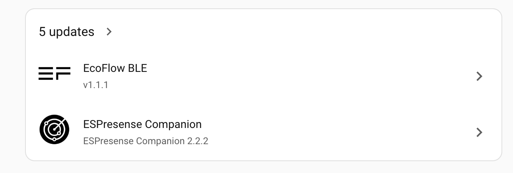
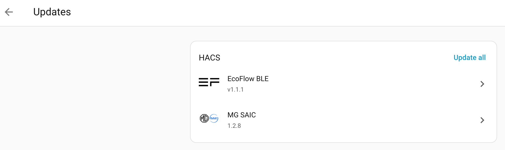

# Troubleshooting & FAQ

Common problems, how to turn on debug logging, and the diagnostic tools shipped with the integration.

← [Back to the main README](../README.md)

---

## 💡 Troubleshooting & FAQ
 
* **"Invalid Credentials" or Connection Timeouts:** Ensure you are choosing the correct region matching your mobile app setup.
* **I changed my password and the integration stopped working:** You no longer need to delete and re-add it — Home Assistant will prompt you to re-enter the new password, or you can trigger it yourself via **Reconfigure**. See [Changing or updating your password](../README.md#changing-or-updating-your-password). If a long, password-manager-generated password won't log in, SAIC may have truncated it when it was set; use around 16 characters or fewer.
* **"The account is not registered" (code 1000036):** Your account exists on a different regional SAIC backend than the one selected. Pick the region matching the country where the account was created — for markets without a built-in preset, use the **Custom** region option to enter your market's endpoint details.
* **Entities showing as 'Unavailable':** The integration respects API rate limits to prevent account lockouts. If an entity is temporarily unavailable, wait for the next scheduled update or use the `button.update_vehicle_data` entity to force a refresh.
* **My App keeps logging me out:** As noted above, ensure your Home Assistant integration uses a **Secondary Account**, not your primary mobile application credentials.
* **Target SOC entity is missing:** Some vehicle models (e.g. MG HS PHEV) do not support remote Target SOC setting via the iSmart API. The entity is intentionally not created for these models.
* **Electric Range shows an unexpected value:** For some PHEV models the live electric range field is not populated by the API. The integration falls back to the estimated-range-after-full-charge figure from the charging management data.
* **Two cars on the same account:** Fully supported. Both vehicles share a single API session so neither interferes with the other.
* **Instant Power sensor shows a stale value after HA restart:** Home Assistant restores entity states from its database on startup. The value will update to `0 kW` on the first successful poll (usually within 30 seconds) if the car is not driving.
* **"Lock Status" binary sensor shows on/off, not Locked/Unlocked:** This is expected HA behaviour for the `lock` device class — see the [Entity States Reference](sensors.md#entity-states-reference) above for exactly what `on` and `off` mean for every status/control entity in this integration.
* **"MG SAIC: Vehicle Not Locked" notification:** A remote command (e.g. starting climate) was rejected because the car isn't locked. Lock it with the key fob or the iSmart app and send the command again — no physical key start is needed. This is a separate condition from **"MG SAIC: Remote Command Limit Reached"**: SAIC uses the same underlying error code for both, but only the command-limit one requires starting the vehicle with the physical key to reset (#374).
* **Charging figures look out of date, or didn't change during an outage:** SAIC's charging endpoint fails independently of everything else, and while it's down the charging sensors hold their last values on purpose. Check the **Charging Data Freshness** sensor — `stale` means the figures are held, and its `last_success` / `data_age_minutes` attributes say from when. See [Charging Data Freshness sensor](power-management.md#charging-data-freshness-sensor).
* **Mileage Since Last Charge suddenly shows thousands of miles (your odometer):** SAIC sometimes sends the odometer in that field. From 1.3.0-beta3 the integration works out the real figure instead — see [below](#mileage-since-last-charge-shows-the-odometer).
* **Last Charge Energy's duration looks far too long, or its average power too low:** before 1.3.0-beta3 these came from when the integration happened to poll, so each end could be up to a whole polling interval late. They now use the car's own record of the charge — see [Trip & efficiency statistics](sensors.md#trip--efficiency-statistics).
* **Mileage / Power Usage Since Last Charge reset to 0 without a charge:** this comes from the car itself. From 1.3.0 the integration detects it and holds the previous figures — see [below](#charging-figures-reset-to-0-without-a-charge).
* **Last Powered On changed, or the integration refreshed, right after a restart even though nobody touched the car:** Before 1.3.0-beta2, a restart could replay an old "Vehicle Start" message (typically from your last drive) as if the car had just been started. That overwrote Last Powered On / Last Powered Off and triggered a couple of unnecessary refreshes. The integration now remembers the last message it processed across restarts — see [Event-Driven Updates](controls.md#event-driven-updates).
* **I can't find the update, or don't realise there is one:** See [Where to find updates](#where-to-find-updates) below — the dashboard summary card doesn't always show every pending update by name.

---

## Charging figures reset to 0 without a charge

Some cars reset their own **Mileage Since Last Charge** and **Power Usage Since Last Charge** counters to 0 — taking **Efficiency Since Last Charge** with them — even though they haven't been charged. This comes from the car, not Home Assistant: SAIC returns a normal, successful response in which the counters have been zeroed, as if a charge had just finished.

A debug log from an MG HS PHEV (#262) caught it happening. After a SAIC outage lasting about two hours (`return code 6`, then `return code 4`), the first successful response showed the counters reset to 0, `lastChargeEndingPower` reset to the battery's current energy, and a charge record stamped *during* the outage with no start time — while battery percentage, charging status, plug state and odometer were all **unchanged**. A genuine charge in the same log had a real start and end time.

**From 1.3.0 the integration detects this and holds the previous figures.** A counter reset is only accepted when there's evidence a charge actually happened since the last reading:

- the car was seen plugged in or charging, **or**
- the battery percentage rose by at least 1% with the odometer unchanged (or by 5% or more even if the car was also driven — more than regen can add), **or**
- the car reports a new charge record with a real start time.

Without any of those, the reset is ignored: the figures carry on from where they were, and anything driven afterwards is added on top. The next genuine charge resets everything as normal. Held figures survive a Home Assistant restart.

It's deliberately cautious: **whenever the evidence is unclear, the reset is accepted**, which is exactly how things behaved before. The only reset it can't judge is one that happens while Home Assistant is off, since there's no earlier reading to compare against.

**How to tell when it's happened:** the log shows a warning — *"since-charge counters reset without a charge … holding the previous figures"* — with the raw and held values, and the **Charging Data Freshness** sensor's attributes show `counter_reset_held: true` and `ignored_counter_reset_at`. If you ever see a genuine charge not reset the counters, please open an issue with a debug log.

**Efficiency Since Charge (SOC)** never reads these counters at all — it works from battery percentage and odometer — so it's a useful cross-check. See [Trip & efficiency statistics](sensors.md#trip--efficiency-statistics).

## Mileage Since Last Charge shows the odometer

A second fault with the same counter: sometimes SAIC sends the car's **odometer** as Mileage Since Last Charge, so it suddenly shows thousands of miles and **Efficiency Since Last Charge** goes with it. An MG HS PHEV (#262) did this after one charge (61120 = odometer 61120, i.e. 6,112 km / 3,797.8 mi) and kept it up — rising with the odometer as the car was driven — until it was next plugged in, when it reset properly to 0. Its next charge ended correctly, so it doesn't happen every time.

**From 1.3.0-beta3 the integration spots it** — a figure exactly equal to the odometer is never trusted — and shows the real distance instead, worked out from the odometer at your last charge (for that car's first drive afterwards: 3.0 km rather than 6,115 km). The odometer at your last charge is remembered across restarts. If the fault is already happening when you first install this version, there's no last-charge figure to work from yet, so the sensor keeps its previous value rather than showing the odometer; it corrects itself at your next charge.

**How to tell:** the log shows a warning — *"SAIC is reporting the odometer … as Mileage Since Last Charge"* — and **Charging Data Freshness** has `mileage_since_charge_from_odometer: true` while it's being worked around.


## Where to find updates

If you've updated the integration through HACS but people are telling you they're still on an old version, it's usually not that the update isn't there — it's that they haven't seen it.

Home Assistant's dashboard shows a summary card like this one, and it only lists a couple of names even when there are more updates waiting:



Five updates are available here, but only two are named on the card. MG SAIC could easily be one of the three not shown, and there's nothing on this card to tell you either way.

**Tap the arrow to see the full list.** Go to **Settings → System → Updates**, or tap through from the summary card above, and every pending update is listed — usually grouped by source, with everything installed through HACS (including this integration) under a **HACS** heading with its own **Update all**:



If you're not seeing a version you expect on your own dashboard, check here before assuming the update hasn't reached you.

---

## How to enable logging
 
* Add the following lines to `configuration.yaml` (or your sub `logger.yaml` file if you have broken down `configuraiton.yaml` into smaller files)
```
  logger:
  default: warning
  
  logs:
    custom_components.mg_saic: debug
```
* Restart Home Assistant
* Go to System -> Logs
* Search for `mg_saic`
* Click the 3 vertical dots
* Choose `Show full logs`

---

## Diagnostic Tools (`tools/`)
 
The [`tools/`](tools/) folder contains optional helper scripts for **researching how a specific car model behaves** — they are not part of the integration and are never loaded by Home Assistant. They let owners capture what the official iSmart app sends and receives, so we can map new features (like climate modes, heated seats, and window control) accurately per model.
 
| File | Purpose |
|------|---------|
| `redact.py` | Strips your login token and sensitive headers from a capture **before** you share it — always run this first. |
 
These scripts only *observe* app traffic; they do not modify your car, account, or the integration. See [`tools/README.md`](tools/README.md) for the full walkthrough. If you'd like to help profile your model, contributions of captured (redacted) data are very welcome.
 
 
